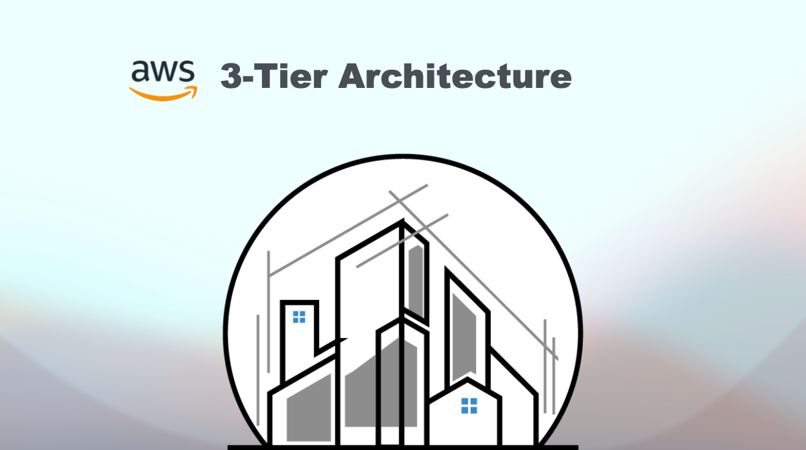
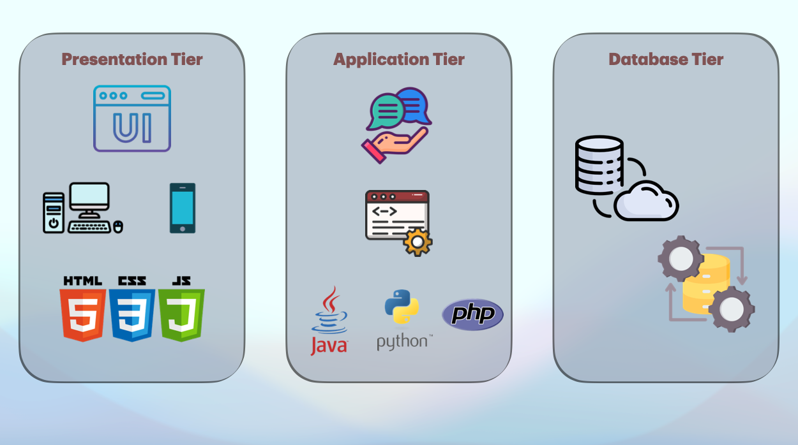
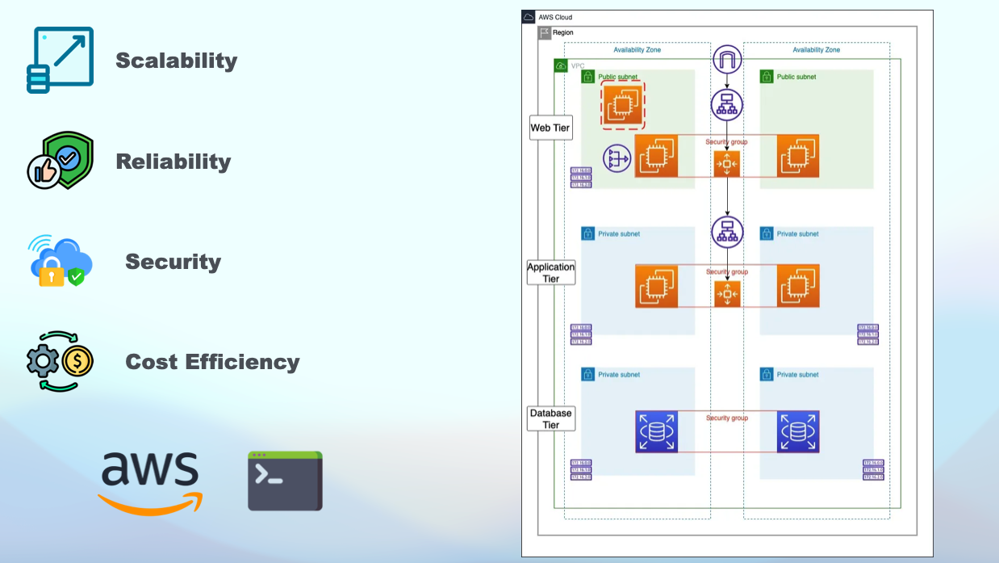
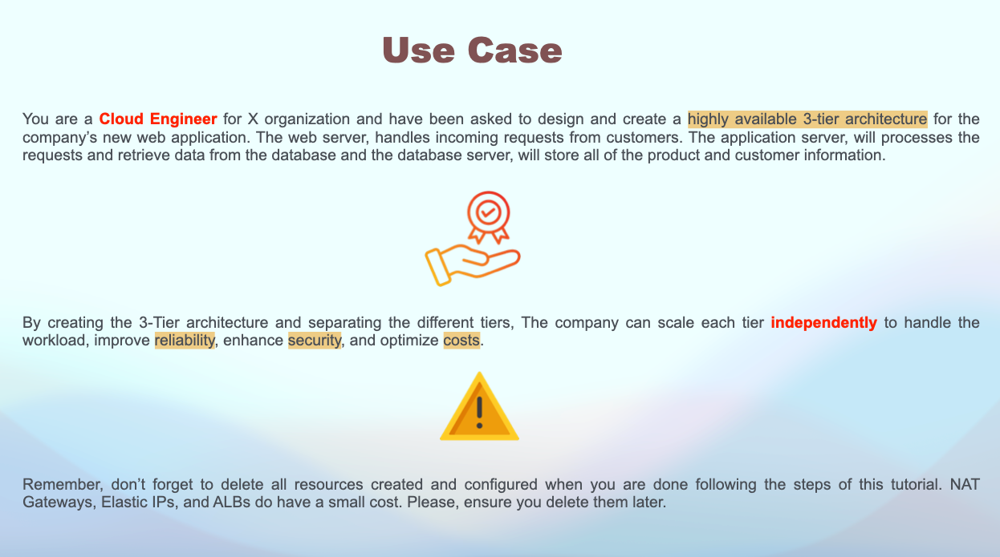
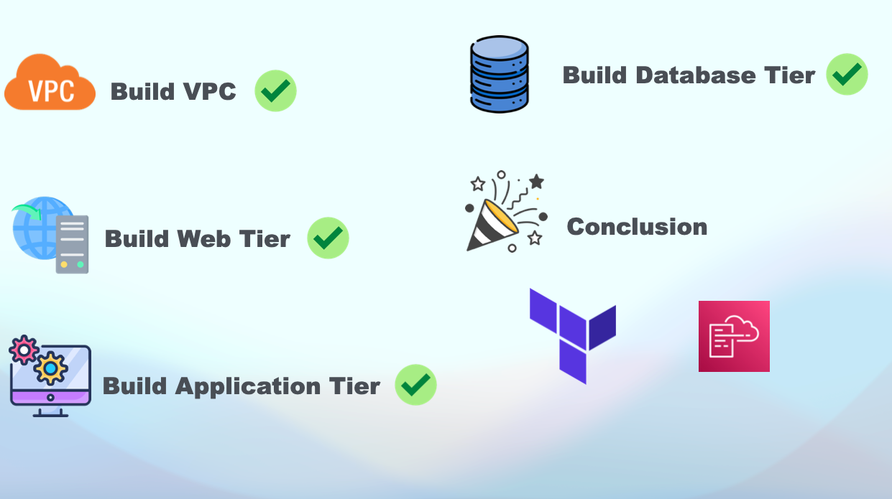

# 🚀 Build AWS 3-Tier Architecture using the console 

## 🌟 Overview
In this guide,  we will build a 3-tier architecture on Amazon Web Services (AWS). 
The 3-tier architecture is one of the most popular application architectures, where an application is split into three logical/physical tiers.

## 📝 Comprehensive Guide
For a detailed guide, please refer to the [Youtube video](https://www.youtube.com/watch?v=YwRXv27BZrw).

## ✅ Slides

Slide 1            | Slide 2         | Slide 3        | Slide 4
:------------------------:|:-----------------------:|:----------------------:|:----------------------:
  |  |  | 

Happy learning 📚